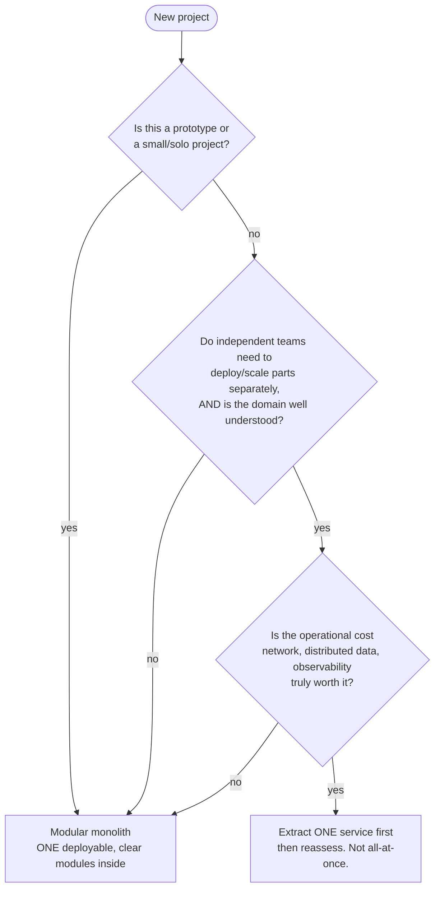
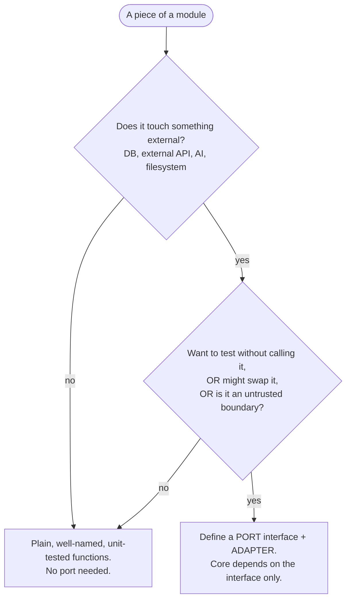

# Architecture Decision Guide

A practical guide for choosing an architecture in projects built from this foundation.
Written to be readable by a junior developer and usable by an AI agent during planning.

The goal is not to sound sophisticated. It is to pick the **simplest architecture that
fully satisfies the approved requirements** (the rule in `CLAUDE.md`) and to know *why*.

---

## 1. The mistake this guide fixes

People compare things that are not alternatives — for example *"should I use microservices
or hexagonal?"*. Those are not on the same ladder. They answer different questions.

There are **two independent axes**. Every project makes a choice on *each* one.

| Axis | Question it answers | Examples |
| ---- | ------------------- | -------- |
| **A. Internal architecture** | How is the code organized *inside* one app? How do dependencies flow? | Layered, Vertical Slice, Hexagonal (Ports & Adapters), Clean/Onion |
| **B. Deployment topology** | In *how many separately deployed pieces* does the system run? | Single app, Modular monolith, Microservices, Event-driven, Serverless |

"Microservices vs hexagonal" is comparing Axis B with Axis A. A system can be a **modular
monolith** (Axis B) that is **internally hexagonal** (Axis A) at the same time — that is
exactly what Omakase-Match is. Both statements are true. They are different questions.

Decide Axis A and Axis B **separately**, and for a prototype, decide Axis B first (it is
almost always "modular monolith") and then focus your energy on Axis A.

---

## 2. Axis B — deployment topology (decide this first, it's usually easy)

**Default for you, today: modular monolith.** One thing to run, deploy, and debug; modules
well separated inside. It is not a beginner's compromise — it is what most healthy systems
should be, and the recommended starting point even for experienced teams.

**When to consider microservices:** only when *organizational* or *scaling* pressure is
real — many teams stepping on each other, or one part needs to scale/deploy on a completely
different rhythm. As a solo developer working with AI agents, that pressure essentially
never exists yet. Microservices trade code-level simplicity for a large operational tax:
network calls that fail, data split across databases, distributed tracing, versioned
contracts between services. **Don't pay that tax to solve a problem you don't have.**

**Event-driven** is a middle option you can practice *without* leaving the monolith: modules
talk through an in-process event bus ("order created" → stock + invoice + email react)
instead of calling each other directly. Great for learning decoupling with zero new infra.

**The healthy path:** modular monolith → *if it genuinely hurts*, extract one service →
reassess. Never start by splitting everything.

---

## 3. Axis A — internal architecture (where your energy should go)

This is the ladder that actually makes code "scalable and understandable by other devs".

### The four rungs

**1. Layered** — controller → service → repository → DB. The instinctive default. Simple,
but business logic tends to become tangled with the database. Fine as a baseline for tiny,
CRUD-only features.

**2. Vertical Slice** — organize by *feature* end to end (`catalog/`, `recommendations/`,
`interpret/`), each folder holding its own API, logic, validation, types, and tests. This
foundation's `CLAUDE.md` already prefers this. It is the highest-value habit for you: it
keeps related code together and is friendly to AI agents (see section 5).

**3. Hexagonal (Ports & Adapters)** — the *core* (domain + use cases) depends on nothing
external. Everything external (DB, HTTP, an AI API) sits behind an **interface (port)** with
a swappable **implementation (adapter)**. The dependency points *inward*: infrastructure
depends on the core, never the reverse. This is what makes a module testable in isolation
and lets you swap providers without touching business logic.

**4. Clean / Onion** — hexagonal plus a stricter set of concentric layers. Powerful, but
easy to over-engineer on small projects. Learn it to understand the *principle* (the
dependency rule); apply it sparingly.

### When to reach for hexagonal *inside a module* (the useful decision)

You do **not** wrap everything in ports. Add a port/adapter for a piece of code **only when
at least one of these is true**:

- it talks to something **external** you'd want to test *without* actually calling it (DB, third-party API, AI);
- you might **swap the provider** later (e.g. Gemini → another model);
- it is an **untrusted boundary** whose input must be validated before the core touches it.

Omakase's `ai` module qualifies on all three — that's why it correctly ended up hexagonal,
even though the foundation's default is "don't add ports unless justified". Pure internal
logic with no external dependency does **not** need a port; just write clean, tested functions.

### The one rule to remember

> **Dependencies point toward the domain, never away from it.**
> Business logic must not depend on details of the database, the transport (HTTP), or the AI
> provider. If it does, that's the beginning of spaghetti — flag it and invert the dependency.

---

## 4. Recommended default for this foundation

For almost every prototype you start:

- **Axis B:** modular monolith.
- **Axis A:** organized by **feature / vertical slice**, with **hexagonal ports only at
  external boundaries** (DB, external APIs, AI), and the **dependency rule** enforced everywhere.

Escalate beyond this only when a concrete, present requirement forces it — and when it does,
**write an ADR** (`docs/adr/`) explaining the trade-off.

---

## 5. Why "modular" also helps AI agents (your own observation, formalized)

You chose modular organization partly because it is easier for agents. That instinct is
correct and worth stating as a principle:

- An agent works within a **limited context window**. A self-contained feature folder can be
  loaded and understood *on its own*, without dragging in the whole codebase.
- Clear module boundaries mean the agent changes one slice **without unintended ripple
  effects** into unrelated code.
- Ports/interfaces give the agent a **stable contract** to code against, so a change on one
  side of a boundary doesn't force it to reason about the other side.
- ADRs and a current architecture diagram give the agent the **"why" and the map** up front,
  reducing wrong assumptions.

So the same choices that make code understandable to *humans* — small modules, clear
boundaries, explicit contracts, recorded decisions — are exactly what make an *agent* more
reliable. Optimizing for one optimizes for the other.

---

## 6. Quick reference

| If you are... | Axis B | Axis A |
| ------------- | ------ | ------ |
| Building any prototype from this foundation | Modular monolith | Vertical slice + ports at external edges |
| Tempted by microservices as a solo dev | Don't. Stay modular monolith | — |
| Adding an external API / DB / AI provider | (unchanged) | Put it behind a port + adapter; validate its input |
| Writing pure internal logic | (unchanged) | Plain tested functions, no port |
| Wanting to decouple features that react to events | Still one deployable | In-process event bus |
| Facing real team-scale or independent-scaling pressure | Extract ONE service, reassess | Keep each service internally clean |

When in doubt: choose the simpler option, and record the decision in an ADR.
