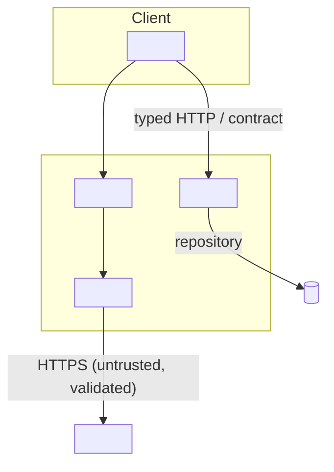
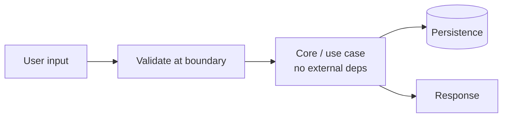
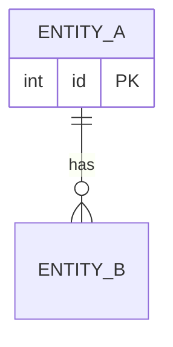

# Architecture

> **Convention:** every concrete project keeps at least one current architecture diagram
> here. Update it whenever module boundaries, data flow, or external dependencies change —
> it is part of "done" for any feature that changes structure. Use Mermaid so the diagram
> is editable and reviewable in Git. This file in the foundation is a **template**; replace
> the placeholders when you start a real project.

## System / container view

*What are the modules, and which external services do they touch?*

## Main use-case data flow

*Trace the single most important request end to end. Mark where untrusted input is validated.*

## Data model (if a database exists)

## Boundaries & trust

- **Trusted:** <code you control and test>
- **Untrusted (validate before use):** <external API responses, uploaded files, AI output, scraped data>
- **Secrets live only in:** <which module reads env vars; never the client>

## Key decisions

See `docs/adr/` for the reasoning behind the structure above.
