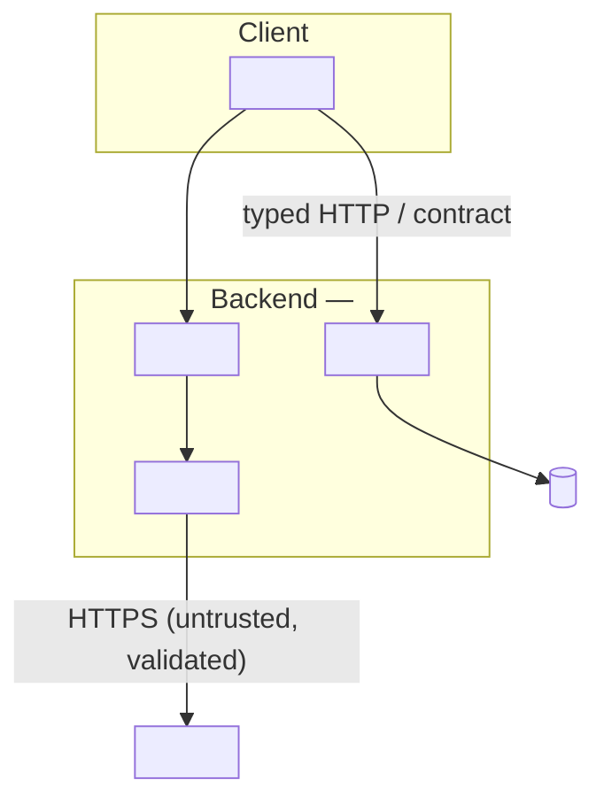
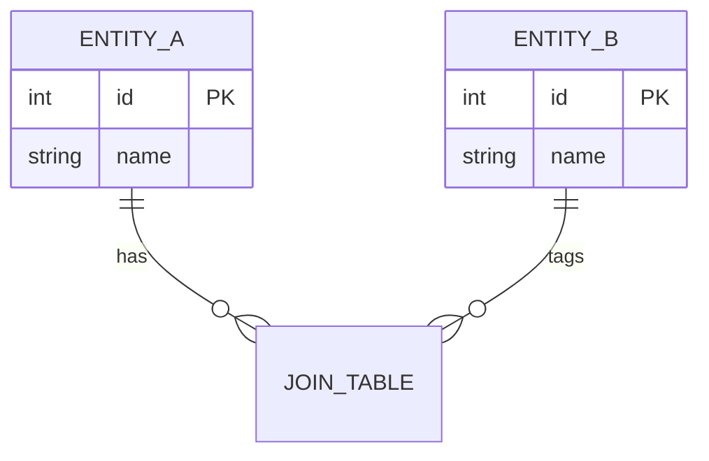

<!--
  PROJECT README TEMPLATE  ·  "Omakase style"
  Copy this file to the repository root as README.md when starting a concrete project,
  then replace every <placeholder>. This describes YOUR product — not the foundation.
  Delete this comment block, and delete any section or diagram that does not apply.

  This template mirrors the structure that worked well for Omakase-Match:
  a clear tagline, a status callout, three integrated Mermaid diagrams
  (flow → system/container → data model), and task-focused run/config/test sections.
  Keep diagrams in Mermaid so they render on GitHub and stay editable in Git.
-->

# <Project name>

<One or two sentences: what it does and who it is for. If the name has a meaning, explain it.>

> **Status:** <working prototype / in development>. <One line on scope — what is and isn't built yet.>

## How it works

```mermaid
flowchart LR
  A[<Input>] --> B{<Decision / branch>}
  B -- <case> --> C[<Step>]
  B -- <case> --> D[<Alternative step>]
  C --> E[<Result>]
  D --> E
```

<A short paragraph describing the core idea or the main flow in plain language.>



- **<Key step>** — <one line on what it does and why>.
- **<Key step>** — <...>.
- **<Fallback / edge behavior>** — <what happens when an optional dependency is off>.

## Architecture

<One paragraph: deployment topology (e.g. modular monolith) + internal organization
(feature modules, ports at external boundaries) + the external services used.>



Key decisions:

- **<Decision>.** <Why, in one line. Link to the ADR: `docs/adr/NNNN-...`.>
- **<Decision>.** <...>
- **<Where secrets live>.** <Which module reads the keys; they never reach the client.>
- **<Organized by capability>.** <Modules named after the domain, not technical layers.>

See [`docs/architecture.md`](docs/architecture.md) for full diagrams and [`docs/adr/`](docs/adr/) for the reasoning.

## Data model

<One line: what is persisted and what is computed per request (not stored).>



## Tech stack

| Area | Choices |
| ---- | ------- |
| **Backend** | <...> |
| **Validation & contract** | <...> |
| **Frontend** | <...> |
| **Data** | <...> |
| **Testing** | <...> |

## Project structure

```
backend/    <one line>
frontend/   <one line>
docs/       architecture diagrams (architecture.md) and decision records (adr/)
specs/      Spec-Driven Development artifacts (spec, plan, contract, data model)
```

## Run it locally

### Prerequisites

- <runtime + version>
- <database / services, if any>
- *(optional)* <optional external key, and what happens without it>

### Steps

```bash
cp .env.example .env          # then fill in local values
<install command>
<migrate / seed command, if any>
<run command>                 # → http://localhost:<port>
```

<Optional: a one-command Docker path, if the project has one.>

## API

<Only if the project exposes an API.>

| Method | Path | Purpose |
| ------ | ---- | ------- |
| `GET`  | `/health` | Liveness check |
| `<..>` | `<..>` | <...> |

## Configuration

Environment variables live in `<path>/.env` (gitignored — see `.env.example`). Secrets and
credentials stay server-side and never reach the browser.

| Variable | Required | Default | Notes |
| -------- | -------- | ------- | ----- |
| `<VAR>`  | yes/no   | <...>   | <...> |

## Testing

```bash
<test command>          # unit
<e2e command>           # integration / browser
```

## Deployment

<One paragraph on how it deploys, if applicable. Otherwise delete this section.>

## How it was built

Built from the [ai-engineering-foundation](https://github.com/Fabugedo/ai-engineering-foundation)
using **Spec-Driven Development** with **Claude Code**. The specification, clarifications,
technical plan, contract, and data model live under `specs/`; the guiding principles are in
`.specify/memory/constitution.md`; architecture decisions are recorded in `docs/adr/`.
